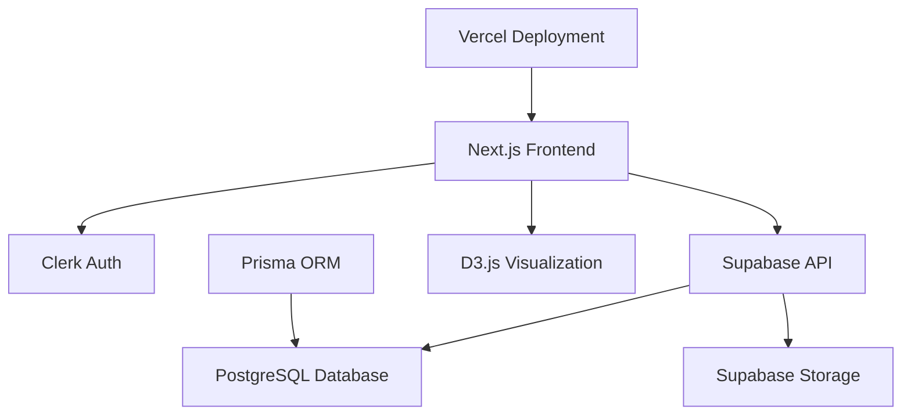

# Design Document

## Overview

The Family Tree Application is built as a modern web application using Next.js with a focus on user experience, security, and scalability. The architecture leverages Supabase for backend services, Clerk for authentication, and D3.js for interactive visualizations. The design emphasizes mobile-first responsive design and accessibility.

## Architecture

### Technology Stack
- **Frontend**: Next.js 14+ with TypeScript, Tailwind CSS
- **Authentication**: Clerk Auth (email/password, Google OAuth)
- **Backend**: Supabase (PostgreSQL, Storage, Edge Functions)
- **Database ORM**: Prisma
- **Visualization**: D3.js for interactive family tree rendering
- **State Management**: Zustand (optional for complex state)
- **Deployment**: Vercel

### System Architecture


## Components and Interfaces

### Core Pages
1. **Landing Page (`/`)**: Hero section, app introduction, authentication CTAs
2. **Dashboard (`/family`)**: Family tree listing, creation interface
3. **Tree View (`/family/[familyId]`)**: Interactive D3.js visualization with person details
4. **Tree Edit (`/family/[familyId]/edit`)**: Form-based editor for people and relationships
5. **Profile Page (`/profile`)**: User profile management

### Key Components
- **TreeVisualization**: D3.js-powered interactive family tree component
- **PersonCard**: Reusable component for displaying person information
- **RelationshipForm**: Form component for creating/editing relationships
- **CollaboratorManager**: Interface for managing tree permissions
- **ExportDialog**: Modal for handling GEDCOM/PDF exports

### API Routes
- `/api/families` - CRUD operations for family trees
- `/api/families/[id]/people` - Person management within trees
- `/api/families/[id]/relationships` - Relationship management
- `/api/families/[id]/collaborators` - Collaboration management
- `/api/export/[id]` - Export functionality (GEDCOM/PDF)

## Data Models

### Database Schema (Prisma)

```prisma
model User {
  id          String   @id @default(cuid())
  clerkId     String   @unique
  email       String   @unique
  displayName String?
  profilePhoto String?
  createdAt   DateTime @default(now())
  updatedAt   DateTime @updatedAt
  
  ownedFamilies    Family[] @relation("FamilyOwner")
  collaborations   FamilyCollaborator[]
  createdPeople    Person[] @relation("PersonCreator")
}

model Family {
  id          String   @id @default(cuid())
  name        String
  description String?
  isPublic    Boolean  @default(false)
  ownerId     String
  createdAt   DateTime @default(now())
  updatedAt   DateTime @updatedAt
  
  owner         User                 @relation("FamilyOwner", fields: [ownerId], references: [id])
  people        Person[]
  relationships Relationship[]
  collaborators FamilyCollaborator[]
}

model Person {
  id           String    @id @default(cuid())
  familyId     String
  firstName    String
  lastName     String?
  gender       Gender?
  birthDate    DateTime?
  deathDate    DateTime?
  profileImage String?
  bio          String?
  createdById  String
  createdAt    DateTime  @default(now())
  updatedAt    DateTime  @updatedAt
  
  family              Family         @relation(fields: [familyId], references: [id], onDelete: Cascade)
  createdBy           User           @relation("PersonCreator", fields: [createdById], references: [id])
  parentRelationships Relationship[] @relation("ParentRelation")
  childRelationships  Relationship[] @relation("ChildRelation")
  partnerRelationships Relationship[] @relation("PartnerRelation")
}

model Relationship {
  id       String           @id @default(cuid())
  familyId String
  type     RelationshipType
  person1Id String
  person2Id String
  createdAt DateTime        @default(now())
  
  family  Family @relation(fields: [familyId], references: [id], onDelete: Cascade)
  person1 Person @relation("ParentRelation", fields: [person1Id], references: [id])
  person2 Person @relation("ChildRelation", fields: [person2Id], references: [id])
}

enum Gender {
  MALE
  FEMALE
  OTHER
}

enum RelationshipType {
  PARENT_CHILD
  SPOUSE
  PARTNER
  ADOPTED
  STEP_PARENT
}

enum CollaboratorRole {
  VIEWER
  EDITOR
}
```

### Data Access Patterns
- **Row-Level Security (RLS)**: Implemented at Supabase level for data isolation
- **Optimistic Updates**: For real-time collaboration experience
- **Caching Strategy**: Leverage Next.js caching for static content, real-time updates for dynamic data

## Error Handling

### Client-Side Error Handling
- **Form Validation**: Real-time validation with clear error messages
- **Network Errors**: Retry mechanisms with exponential backoff
- **Authentication Errors**: Automatic redirect to login with context preservation
- **Visualization Errors**: Graceful fallbacks when D3.js rendering fails

### Server-Side Error Handling
- **Database Constraints**: Proper error mapping to user-friendly messages
- **File Upload Errors**: Size and type validation with clear feedback
- **Rate Limiting**: Implement rate limiting for API endpoints
- **Data Integrity**: Transaction-based operations for complex updates

### Error Boundaries
```typescript
// Global error boundary for React components
class FamilyTreeErrorBoundary extends React.Component {
  // Handle visualization and component errors gracefully
}
```

## Testing Strategy

### Unit Testing
- **Components**: Test React components with React Testing Library
- **API Routes**: Test Next.js API routes with Jest
- **Utilities**: Test helper functions and data transformations
- **Database Operations**: Test Prisma queries and mutations

### Integration Testing
- **Authentication Flow**: Test Clerk integration end-to-end
- **Database Operations**: Test Supabase RLS policies
- **File Upload**: Test Supabase Storage integration
- **Export Functionality**: Test GEDCOM and PDF generation

### End-to-End Testing
- **User Workflows**: Test complete user journeys with Playwright
- **Cross-Browser**: Ensure compatibility across major browsers
- **Mobile Responsiveness**: Test touch interactions and responsive design
- **Performance**: Test visualization performance with large family trees

### Testing Tools
- **Jest**: Unit and integration testing framework
- **React Testing Library**: Component testing
- **Playwright**: End-to-end testing
- **MSW (Mock Service Worker)**: API mocking for tests

## Security Considerations

### Authentication & Authorization
- **Clerk Integration**: Secure token-based authentication
- **RLS Policies**: Database-level access control
- **Route Protection**: Middleware-based route protection
- **Session Management**: Secure session handling

### Data Protection
- **Input Sanitization**: Prevent XSS and injection attacks
- **File Upload Security**: Validate file types and sizes
- **CORS Configuration**: Proper cross-origin resource sharing setup
- **Environment Variables**: Secure handling of sensitive configuration

### Privacy
- **Data Minimization**: Collect only necessary user data
- **Consent Management**: Clear privacy policy and data usage
- **Data Retention**: Implement data deletion policies
- **Audit Logging**: Track data access and modifications

## Performance Optimization

### Frontend Performance
- **Code Splitting**: Lazy load components and routes
- **Image Optimization**: Next.js Image component with proper sizing
- **Bundle Analysis**: Regular bundle size monitoring
- **Caching**: Implement proper caching strategies

### Database Performance
- **Indexing**: Proper database indexes for query optimization
- **Query Optimization**: Efficient Prisma queries
- **Connection Pooling**: Optimize database connections
- **Data Pagination**: Implement pagination for large datasets

### Visualization Performance
- **D3.js Optimization**: Efficient rendering for large family trees
- **Virtual Scrolling**: Handle large datasets in visualizations
- **Debouncing**: Optimize user interactions and updates
- **Memory Management**: Proper cleanup of D3.js resources